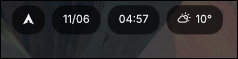
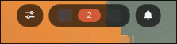
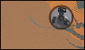
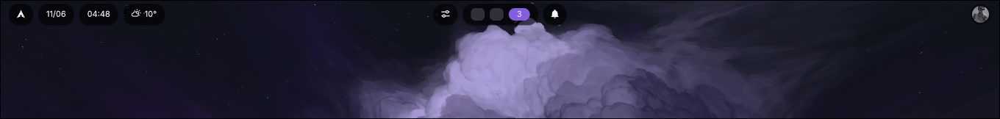
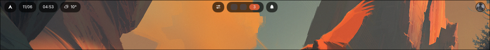
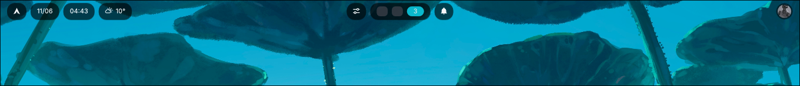

Technical decisions:

### Rust and native Wayland

I built the bar directly on top of the `Wayland` protocol using `smithay-client-toolkit` and `wayland-client`, with no UI frameworks on top. This gives me full control over the layer-shell surface and keeps the binary lightweight. The event loop runs on `calloop`, which integrates Wayland events with the rest of the application's sources.

### GPU rendering

Drawing goes through `wgpu` with `Vello` for the 2D scenes and `Parley` for text shaping and layout. Instead of rasterizing on the CPU, the whole bar is rendered on the GPU, which keeps consumption low even with frequent updates like the clock or the workspaces.

### Component system

Each widget on the bar is a _pill_ that implements a `Component` trait with three responsibilities: measure its own size, render itself within the bounds the layout assigns it, and report interactions through hit testing. The layout distributes the components across three zones (left, center and right), and the colors, spacings and radii live centralized in a system of `tokens`, just like in a design system.

### IPC with Hyprland

The workspace integration talks directly to `Hyprland`'s Unix sockets: one for queries and dispatches, and another for the event stream. I implemented the IPC client by hand instead of using an external library, with timeouts on the reads so the background workers can shut down cleanly. The long-lived threads are always _owned_ through handles with a shutdown token, never detached.

### Dynamic colors

The bar loads its accent color from `hyprcolor`, so it adapts automatically to the wallpaper.

### Weather

The weather pill queries `Open-Meteo`, detecting the approximate location by IP, and all the external JSON is deserialized into typed structs with `serde` instead of navigating values ad-hoc.

### Code quality

The parsers, the layout and the hit testing have integration tests, and CI runs formatting, tests and `Clippy` with warnings treated as errors on every push. The same battery of checks can be run locally before committing.

### Current status

The project is at an early but functional stage: it renders a top bar with logo, date, clock, weather, interactive workspaces with hover and click, and an optional profile avatar. The architecture is designed so the bar can grow component by component without becoming unmaintainable.

For more information, you can read the readme on [GitHub](https://github.com/fedeMaidana/hyprbar).
