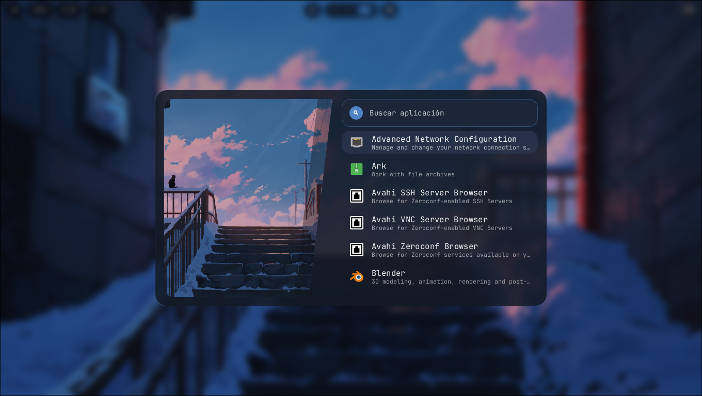
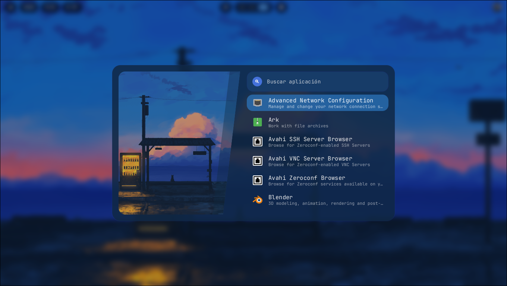
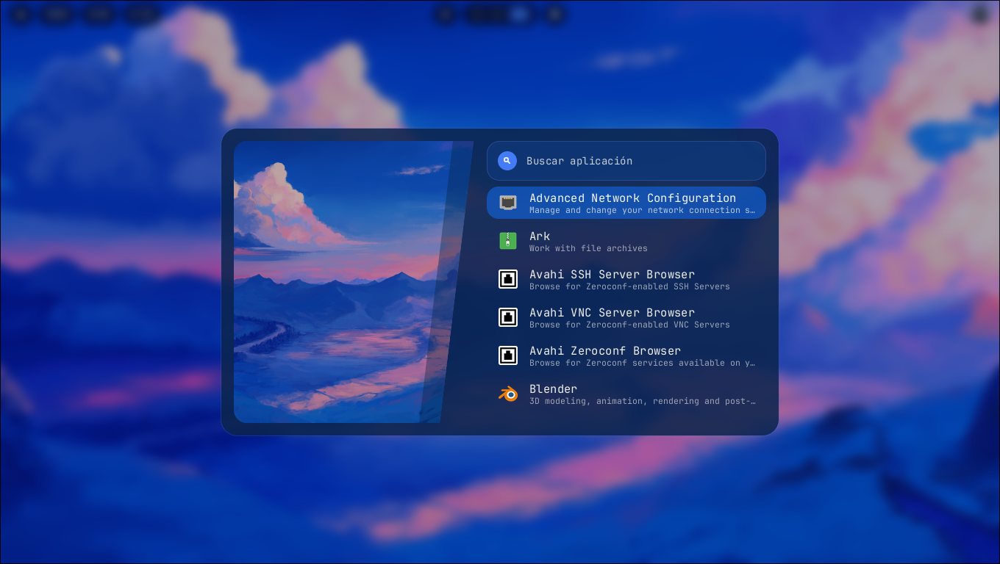

Technical decisions:

### An overlay layer, not a window

Hyprlauncher draws itself as a Wayland `layer-shell` surface on the overlay layer, using `smithay-client-toolkit`. Instead of being just another compositor window, it's a layer that covers the whole screen with exclusive keyboard interactivity, so the launcher shows up on top of everything and captures the keys without fighting the rest of the environment. When it closes, it releases the screen and that's it.

### Elm architecture

State lives under a Model–Msg–Cmd pattern: Wayland events (keys, mouse, scroll, resize) are translated into messages, a pure `update` function decides how the state changes and which effects to fire, and the resulting commands —redraw, launch the app, adjust the scale, quit— are executed separately. The concrete upside is that all the search, selection and scroll logic stays free of Wayland and can be tested with pure functions, without spinning up a compositor.

### Software rendering

There's no GPU here: each frame is rasterized by hand onto a shared-memory buffer with `tiny-skia`, and text is drawn glyph by glyph with `fontdue`, including ellipsis truncation when a name doesn't fit. The drawing is first laid out in logical coordinates, and only at paint time is it multiplied by the screen's scale factor, so HiDPI support stays concentrated in a single place. To avoid redundant repaints, redraws are scheduled through the surface's _frame callback_ instead of firing on every event.

### Scanning and launching applications

The launcher walks the XDG application directories recursively, deduplicates by id, and parses the `[Desktop Entry]` section of each `.desktop` file, skipping entries flagged as hidden or no-display and anything that isn't an application. To run one, it first strips the standard _field codes_ (`%u`, `%F` and friends) and then splits the `Exec` line respecting quotes before spawning the process, rather than handing it raw to a shell.

### Ranked search with a windowed list

Each entry is scored against what you type: exact name, prefix match, substring, and then the generic name and the comment, with decreasing priority. Results are sorted by score and alphabetically, and capped at a configurable maximum. The visible list is a _window_ that slides over the full result set with its own scroll offset, so it stays smooth even with hundreds of applications, because it never draws more rows than fit on screen.

### Asynchronous icon pipeline

This is the juiciest part. Icons never block the UI: a background worker thread receives icon names over a channel, resolves them against an index of the theme directories —scoring candidates to prefer scalable SVGs and application icons, penalize _symbolic_ ones, and favor larger sizes—, decodes raster images with the `image` crate (rescaling with Lanczos3) or renders SVGs with `resvg`, and publishes the result into a shared map. An atomic flag tells the render loop to repaint when new icons arrive. While an icon loads, the row shows the name's initial as a placeholder, so there's never an empty gap.

### On-disk icon cache

Every decoded or rendered icon is saved once as a PNG in `~/.cache/hyprlauncher/icons` and reused across runs, so the second launch is instant. There's also a `--warm-icon-cache` mode that warms that cache ahead of time —at login, for example— without opening the UI, so that everything is already resolved by the time you actually open the launcher.

### Dynamic colors and wallpaper preview

The launcher loads its palette from `hyprcolor` (with a fallback theme if it isn't available), so it adapts to the wallpaper on its own, and it shows a preview of the current background in the side panel using the path `hyprcolor` exports. No GTK, no Qt, no Electron: just Wayland and a lightweight binary.
