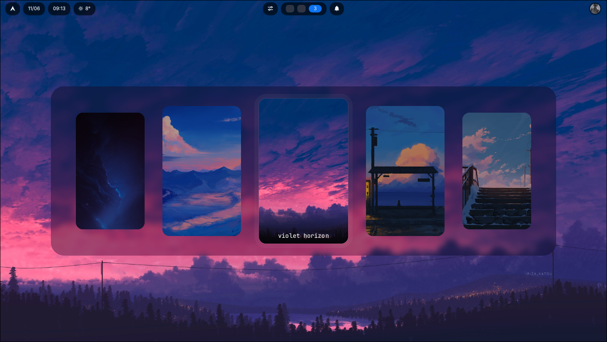
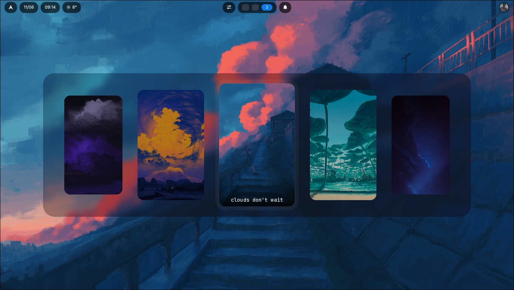
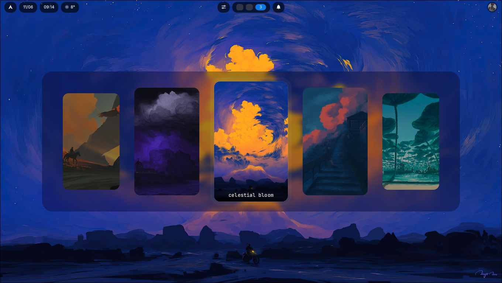

Decisiones técnicas:

### Una capa overlay, no una ventana

Hyprwall se dibuja como una superficie `layer-shell` de Wayland en la capa overlay, usando `smithay-client-toolkit`. En vez de ser una ventana más del compositor, es una capa que cubre la pantalla con interactividad de teclado exclusiva, así el selector aparece por encima de todo y captura las flechas sin pelear con el resto del entorno.

### Arquitectura Elm

El estado vive bajo un patrón Model–Msg–Cmd: los eventos de Wayland se traducen a mensajes, una función `update` pura decide cómo cambia el estado y qué efectos disparar, y los comandos resultantes (redibujar, aplicar wallpaper, salir) se ejecutan aparte. La ventaja concreta es que toda la lógica de navegación y selección queda libre de Wayland y se puede testear con funciones puras, sin levantar un compositor.

### Render por software propio

No hay GPU acá: cada frame se rasteriza a mano sobre un buffer de memoria compartida con `tiny-skia`, y el texto de las etiquetas se dibuja glyph por glyph con `fontdue`, incluyendo recorte con elipsis cuando un nombre no entra. El pipeline está partido en dos etapas: primero se construye una _escena_ —una lista de comandos de dibujo independiente de la resolución— y después un rasterizador la pinta aplicando el factor de escala. Eso mantiene el soporte HiDPI en un solo lugar y deja la construcción de la escena fácil de testear.

### Carrusel con foco central

El layout ubica el wallpaper seleccionado grande y centrado, y los demás se reparten a los costados encogiéndose con la distancia, envolviéndose de forma circular. Solo se calculan las tarjetas que caben en pantalla. El hit testing para el click sale del mismo layout, de modo que lo que ves y lo que podés clickear nunca se desincronizan.

### Carga en paralelo

Al arrancar, los wallpapers del directorio se decodifican y se reducen a miniaturas en paralelo con `rayon`, preservando el orden alfabético original pese a que terminen en cualquier orden. Las imágenes se decodifican una sola vez a un tamaño acotado, no al resolver cada frame.

### Aplicar wallpaper

Para fijar el fondo, hyprwall prueba en cascada `awww`, `swww` y `hyprctl hyprpaper`, levantando el daemon correspondiente si hace falta y esperando a que aparezca su socket. Funciona con la herramienta que ya tengas instalada en lugar de imponer una. Tras aplicar, recuerda el wallpaper actual en cache y deja un symlink — que es justamente de donde `hyprcolor` y `hyprbar` leen el fondo activo para recolorear el resto del escritorio.

### Tests

La lógica pura —el reducer de estado, la navegación del picker, la construcción de la escena— tiene cobertura de tests unitarios: que las flechas envuelvan, que un click cambie la selección y dispare la aplicación, que la escena emita primero el panel y luego las tarjetas. Lo que toca Wayland queda como una capa fina de traducción sin decisiones propias, así que no necesita un compositor para probarse.

### Estado actual

Funciona de punta a punta: escanea el directorio, muestra el carrusel, navega con teclado o mouse y aplica el wallpaper elegido. Es la pieza que cierra el ecosistema —elige el fondo que `hyprcolor` convierte en paleta y que `hyprbar` refleja en su color de acento.
