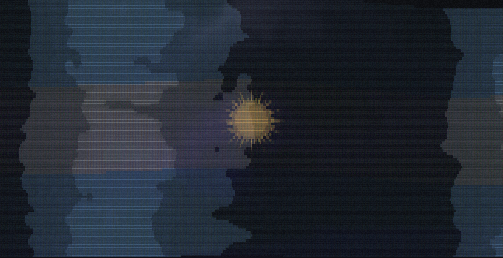

Decisiones técnicas:

### Astro

Elegí Astro porque manda muy poco JavaScript al navegador. Para un portafolio estático donde el contenido es lo que importa, eso significa cargas casi instantáneas sin sacrificar interactividad donde realmente hace falta.

La arquitectura de componentes `astro` me permitió separar cada sección en piezas independientes que son fáciles de mantener.

### Bun como runtime

Usé `bun` en lugar de Node.js. Las instalaciones de dependencias y los builds son más rápidos.

### TypeScript estricto

Todo está tipado con `TypeScript` en su modo más estricto. En la práctica esto quiere decir que los errores aparecen mientras escribo y no cuando el sitio ya está publicado. Los datos de cada proyecto también se validan con `Zod` antes de compilar, así que nunca sale algo roto.

### CSS nativo

Decidí no usar `Tailwind` o algún otro framework CSS. En su lugar utilice CSS nativo organizado con capas `@layer`, que me deja controlar los estilos de forma ordenada. La minificación la hace `LightningCSS`, que es rápida y deja el archivo final pequeño.

Las tipografías van servidas desde el propio sitio y precargadas, así no hay saltos ni parpadeos de texto al abrir la página.

### Fondo animado

El fondo es una bandera Argentina dibujada con caracteres `ASCII`. Corre en un hilo aparte para no trabar el resto de la página, se adapta al tamaño de pantalla y respeta la preferencia de quienes prefieren menos movimiento.

### Pensado también para mobile

En el teléfono todo el contenido se unifica en un solo bloque a pantalla completa, con las secciones separadas por líneas. Los textos y espaciados se ajustan para que se lean cómodos en pantallas chicas.

### SEO y datos estructurados

Sumé datos estructurados `JSON-LD` en cada página para que tanto buscadores como asistentes de IA entiendan quién soy y qué hago. El mapa del sitio y el `robots.txt` se generan solos en cada publicación.

### Accesibilidad

Se puede navegar entero con teclado, cada sección está bien etiquetada y los iconos decorativos se ocultan a los lectores de pantalla. Un chequeo automático corre en cada cambio para no dejar pasar problemas.

### Calidad de código

Antes de cada commit, el código pasa solo por un formateador y un revisor automático. Son diez minutos de configuración que ahorran un montón de errores tontos y discusiones de formato.

### En producción

Está publicado en `Vercel`, con métricas de tráfico y de velocidad real en distintos dispositivos. Los headers de seguridad están configurados para proteger el sitio.
